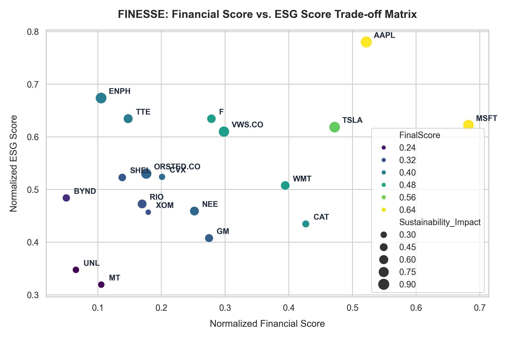
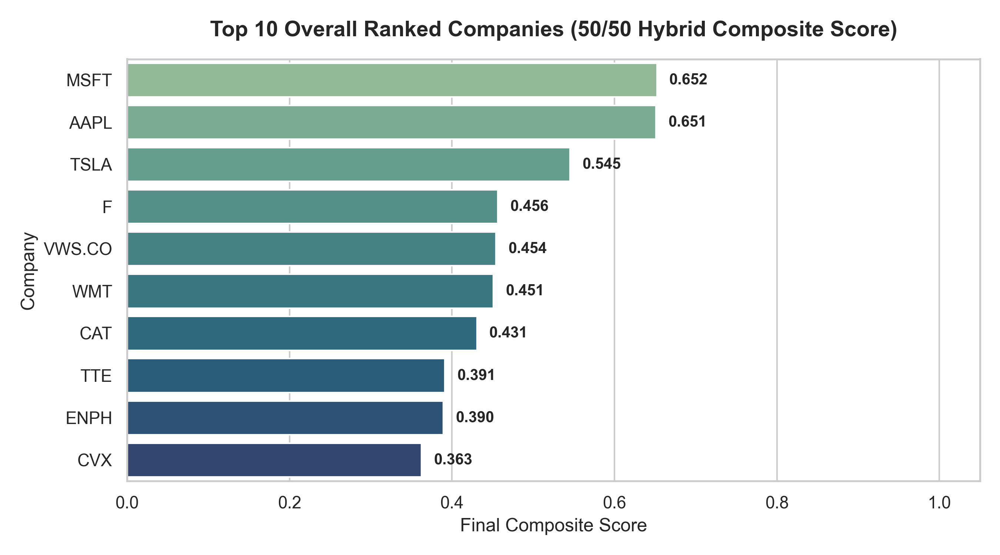
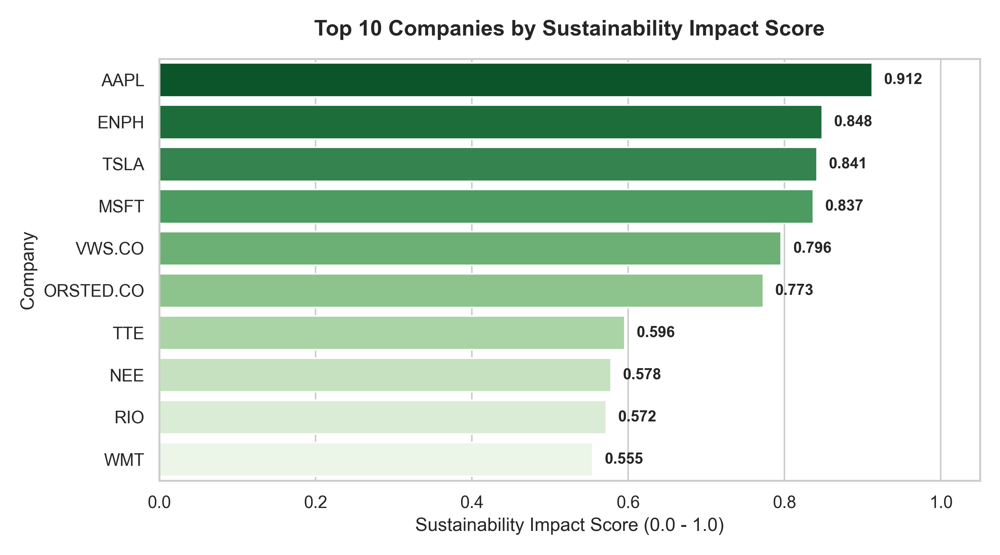
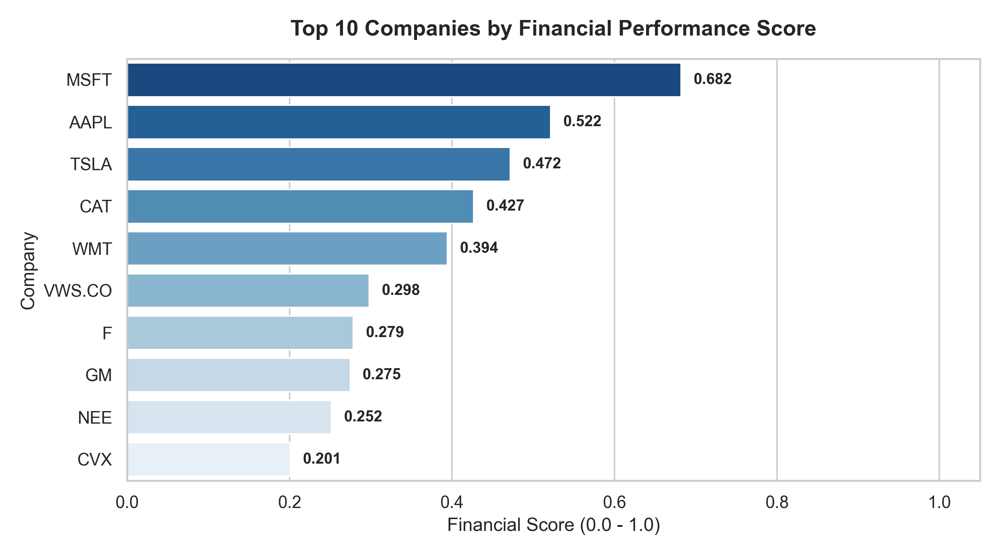

# FINESSE: Financial Intelligence for Navigated ESG Evaluation and Strategy Engine

> An Autonomous Agentic AI Framework for Sustainable Portfolio Allocation and Green Investment Optimization.

[-blue)](https://link.springer.com)
[](#tech-stack)
[](LICENSE)

---

## Research Presentation

This repository contains the official codebase and experimental framework for the research paper:

> **"Agentic Artificial Intelligence for Sustainable Finance: An Autonomous Approach to Green Investment"**  
> *Presented at:* **ISDIA 2026** — 10th International Conference on Information Systems Design and Intelligent Applications (Dubai, UAE)  
> *Proceedings by:* **Springer**

---

## Overview

Sustainable investing requires balancing dual objectives: maximizing risk-adjusted financial returns while ensuring verifiable Environmental, Social, and Governance (ESG) compliance. Traditional investment strategies often treat ESG ratings and quantitative financial metrics as disconnected silos, leading to greenwashing vulnerabilities or suboptimal capital allocations.

**FINESSE** is an autonomous, agentic AI decision-support system designed to reconcile ESG criteria with financial fundamentals. By combining dynamic financial data retrieval (`yfinance`), multi-attribute MinMax normalization, customizable hybrid scoring weighting schemes, and local agentic LLM reasoning (via Ollama / OpenAI), FINESSE provides investors and portfolio managers with transparent, real-time rankings and actionable trade-off insights for green asset allocation.

---

## Dashboard & Visualizations

### 1. Finance vs. ESG Trade-off Matrix

The multi-attribute trade-off matrix visualizes how companies position themselves across normalized Financial Performance (x-axis) and ESG Performance (y-axis), with bubble size indicating overall Sustainability Impact:



---

### 2. Top-Ranked Companies (50/50 Hybrid Composite Score)



---

### 3. Sustainability Impact & Financial Performance Comparison

| Top 10 by Sustainability Impact | Top 10 by Financial Score |
|:---:|:---:|
|  |  |

---

## Key Features

- **Multi-Dimensional Data Preprocessing**: Comprehensive integration of ESG indicators (Environmental Risk, Social Risk, Governance Score, Renewable Energy %) and quantitative financial metrics (Market Cap, P/E Ratio, EPS, Revenue Growth, Debt-to-Equity, Dividend Yield) across 20+ global corporations.
- **Dynamic Hybrid Scoring Engine**: Normalizes disparate indicator scales via MinMax transformation and computes configurable weighted hybrid scores (e.g., 50/50 balanced, 60/40 finance-first, 40/60 ESG-first):
  $$\text{FinalScore} = (w_{\text{finance}} \times \text{Financial Score}) + (w_{\text{ESG}} \times \text{ESG Score})$$
- **Agentic AI Financial Analyst**: Context-grounded conversational agent powered by local LLMs (via Ollama) or OpenAI APIs with strict factual prompting to answer complex cross-company trade-off queries without hallucinations.
- **Smart Multicriteria Filtering**: Instantly filters assets across governance thresholds, ESG criteria, low-debt/low-risk boundaries, and high dividend yield profiles.
- **Green vs. Conventional Portfolio Benchmarking**: Simulates and contrasts green allocations against traditional carbon-heavy baselines.
- **Interactive Streamlit Dashboard**: User interface featuring real-time telemetry, interactive scatter plots, correlation matrices, and custom portfolio allocation sliders.

---

## Architecture

```
┌─────────────────────────────────────────────────────────┐
│                 Data Acquisition Layer                  │
│    - Static ESG Indicators (company_full_metrics.csv)   │
│    - Live Market Feeds via yfinance (Price, P/E, EPS)   │
└────────────────────────────┬────────────────────────────┘
                             │
                             ▼
┌─────────────────────────────────────────────────────────┐
│               Feature Scaling & Analytics               │
│    - Scikit-Learn MinMaxScaler Normalization            │
│    - Inverted Penalty Metrics (Debt/Equity, ESG Risk)   │
│    - Hybrid Scoring Matrix (Financial vs. ESG Weights)  │
└──────────────┬───────────────────────────┬──────────────┘
               │                           │
               ▼                           ▼
┌─────────────────────────────┐ ┌─────────────────────────┐
│   Streamlit Dashboard UI    │ │  Agentic LLM Controller │
│  - Multi-tab Visualizer     │ │  - Ollama (TinyLlama)   │
│  - Interactive Allocations  │ │  - OpenAI API Fallback  │
│  - Scatter & Ranking Charts │ │  - Grounded Context Q&A │
└─────────────────────────────┘ └─────────────────────────┘
```

---

## Tech Stack

| Layer | Tools & Frameworks |
|---|---|
| **Programming Language** | Python 3.10+ |
| **User Interface & Web App** | Streamlit |
| **Data Processing & ML** | Pandas, NumPy, Scikit-Learn (`MinMaxScaler`) |
| **Market Data Ingestion** | `yfinance` API |
| **Data Visualization** | Matplotlib, Seaborn |
| **Agentic AI & NLP** | Ollama (Local LLMs), OpenAI API, Requests |
| **Development & Container** | VS Code Dev Containers, Git |

---

## Project Structure

```
FINESSE/
├── .devcontainer/               # VS Code development container configuration
├── images/                      # Generated dashboard plots and trade-off matrices
│   ├── finance_vs_esg_tradeoff.png
│   ├── top_composite_rankings.png
│   ├── top_financial_score.png
│   └── top_sustainability_impact.png
├── outputs/
│   ├── company_ranked_scores.csv# Output of the hybrid scoring engine with final rankings
│   └── plots/                  # Diagnostic plot directory
├── app.py                       # Main Streamlit web application & agentic chatbot
├── company_full_metrics.csv     # Baseline company financial and ESG dataset
├── EDA.ipynb                    # Exploratory Data Analysis and scoring prototyping notebook
├── requirements.txt             # Python dependencies
├── .gitignore                   # Excludes .venv, cache, and secrets
├── LICENSE                      # MIT License
└── README.md                    # Project documentation & presentation info
```

---

## Setup & Installation

### 1. Clone the Repository

```bash
git clone https://github.com/mayankt411/Agentic-AI-for-Sustainable-Finance-An-Autonomous-Approach-to-Green-Investment.git
cd Agentic-AI-for-Sustainable-Finance-An-Autonomous-Approach-to-Green-Investment
```

### 2. Set Up Virtual Environment

```bash
# Create virtual environment
python -m venv .venv

# Activate virtual environment
# On Windows (PowerShell):
.venv\Scripts\Activate.ps1
# On Linux / macOS:
# source .venv/bin/activate
```

### 3. Install Dependencies

```bash
pip install -r requirements.txt
```

### 4. (Optional) Set Up Local LLM via Ollama

To enable the local AI agent for dataset-grounded queries:

```bash
# Download and install Ollama from https://ollama.com
# Pull the lightweight TinyLlama model (or mistral / llama3)
ollama pull tinyllama
ollama run tinyllama
```

### 5. Launch the Application

```bash
streamlit run app.py
```

*Open `http://localhost:8501` in your browser.*

---

## Results & Scoring Methodology

The hybrid scoring model evaluates each company on a normalized scale $[0.0, 1.0]$. Key outcomes from the empirical evaluation:

### Top-Ranked Assets (50/50 Hybrid Weighting)

| Rank | Company / Ticker | Sector | Financial Score | ESG Score | Final Composite Score | Sustainability Impact |
|:---:|:---|:---|:---:|:---:|:---:|:---:|
| **1** | **MSFT** (Microsoft) | Technology | **0.682** | 0.622 | **0.652** | 0.837 |
| **2** | **AAPL** (Apple) | Technology | 0.522 | **0.780** | **0.651** | 0.912 |
| **3** | **TSLA** (Tesla) | Clean Tech / EV | 0.472 | 0.619 | **0.545** | 0.841 |
| **4** | **F** (Ford) | Automotive | 0.279 | 0.634 | **0.456** | 0.534 |
| **5** | **VWS.CO** (Vestas Wind) | Renewable Energy | 0.298 | 0.610 | **0.454** | 0.796 |

### Empirical Insights
- **Tech Sector Leadership**: High governance scores, low debt-to-equity ratios, and aggressive renewable energy procurement enable large-cap tech firms (MSFT, AAPL) to achieve top composite rankings.
- **Renewable Energy Trade-offs**: Dedicated green pure-plays (e.g., Vestas Wind `VWS.CO`, Orsted `ORSTED.CO`) achieve superior environmental risk ratings ($> 0.80$) but experience capital-intensive financial friction that depresses their short-term financial scores.
- **Traditional Energy Transition**: Fossil energy majors (XOM, CVX) rank lower in overall sustainability impact ($\le 0.28$) due to carbon liabilities, despite offering higher dividend yield profiles.

---

## License

This project is licensed under the [MIT License](LICENSE).
